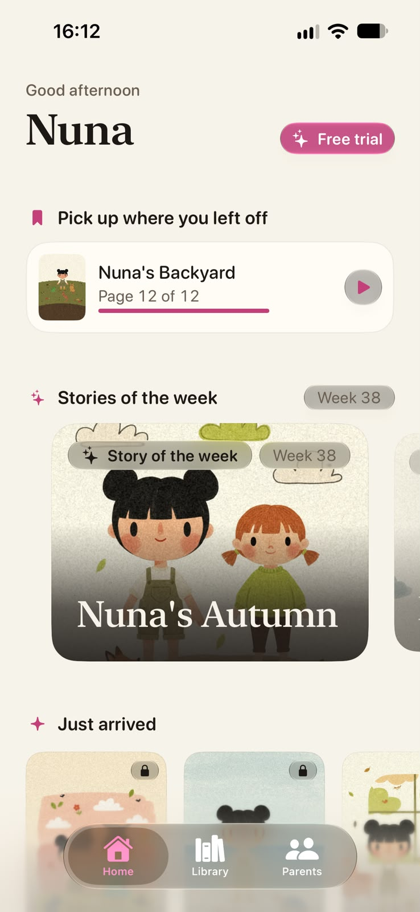
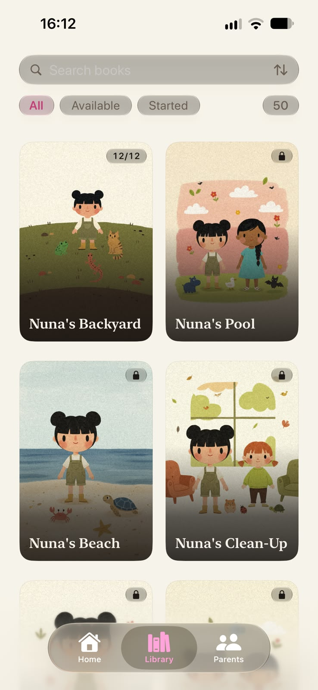
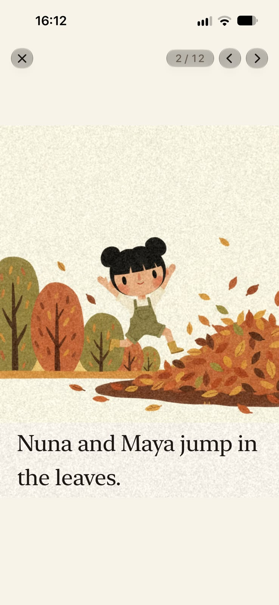
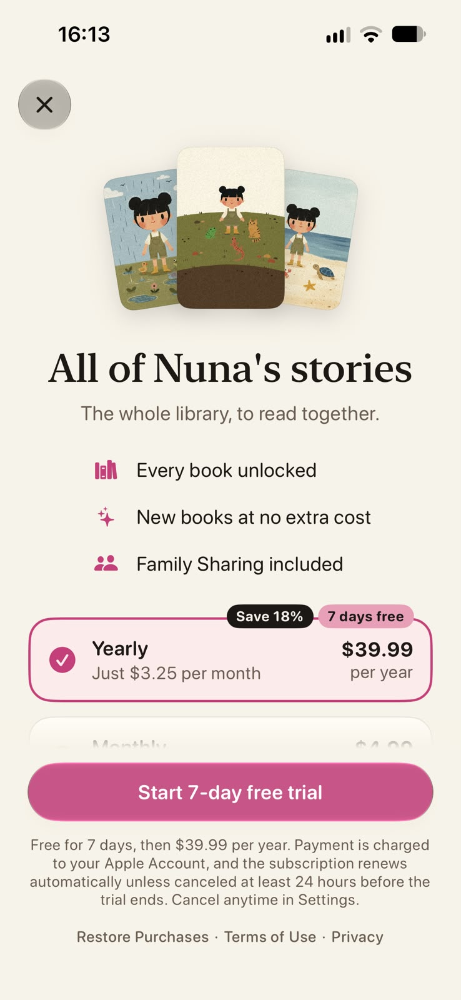
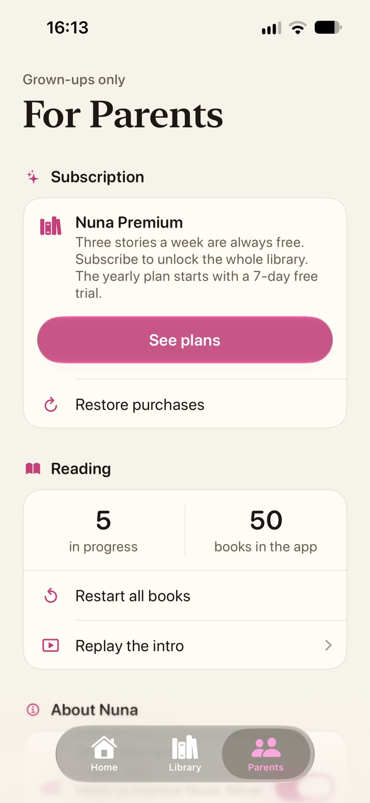

# Nuna

An iOS picture-book app for children aged 3–6, built for the iPhone Duo.
SwiftUI, iOS 27.1.

Sibling folder for content generation: `scripts-picturebook/`.

## Screens

| Home | Library | Reader | Subscription | Parents |
|:---:|:---:|:---:|:---:|:---:|
|  |  |  |  |  |

## Status

Onboarding, Home, Library and reader are in place, with the design system
applied and the first book loading. There is no illustration yet:
`BandPlaceholder` draws the horizontal bands with each spread's colors, so the
whole layout can already be checked without art.

## Structure

```
Nuna/
  DesignSystem/
    Palette.swift      13 locked colors + UI tokens (which do NOT use the palette)
    Typography.swift   New York (reading) and SF Rounded (UI), 24pt floor
    Layout.swift       4pt spacing, safe zone, fold constants
  Models/
    Book.swift         Book, Spread, LocalizedText with language fallback
  Services/
    BookLoader.swift   reads the JSON from the bundle
    Store.swift        StoreKit 2: plans, purchase, restore, isPremium
  Views/
    RootView.swift           Liquid Glass TabView + reader and paywall presentation
    Paywall/                 parental gate + custom paywall
    PageView.swift           illustration + reserved text band
    SpreadView.swift         compact = 1 page, regular = full spread
    ReaderView.swift         state that survives the fold
    Onboarding/              3 screens, text inside the art's reserved band
    Home/HomeView.swift      continue-reading hero + horizontal shelf
    Library/LibraryView.swift  adaptive grid by size class
    Shared/SafeZoneImage.swift  image whose bottom band blends into the background
    Shared/BookCover.swift
  Resources/
    o-quintal-da-nuna.json   12 spreads, pt-BR / en / es-MX
    onboarding.json          3 pages, pt-BR / en / es-MX
  Nuna.storekit        local plan configuration (Xcode only)
```

The target uses a group synchronized with the file system, so dropping files
inside `Nuna/` is enough — no need to edit `project.pbxproj`.

## The book

"Nuna's Backyard", 12 spreads. Mirror structure: on the left page Nuna does
something, on the right page an animal does the same thing better. The arc
covers a whole day, from waking up to going to sleep, which also moves the
palette from morning yellow to night brown.

Original text. At most 6 words per page in all three languages.

## Liquid Glass

On iOS 26+ the standard tab bar **already is** Liquid Glass. `.glassEffect` is
not applied to it — hand-made glass is only for custom controls. What the app
uses:

| Where | API |
|---|---|
| Tab bar | standard `TabView` + `Tab(_:systemImage:value:)` |
| Shrink on scroll | `.tabBarMinimizeBehavior(.onScrollDown)` |
| Card over the hero | `.glassEffect(.regular, in: .rect(cornerRadius:))` |
| Close-book button | `.glassEffect(.regular.interactive(), in: .capsule)` |
| Onboarding CTA | `.buttonStyle(.glassProminent)` |
| Scroll edge | `.scrollEdgeEffectStyle(.soft, for: .bottom)` |

All centralized in `DesignSystem/Glass.swift`, so it changes in one place.

**Where there is NO glass:** the bottom 20% band of any page. That is where
the story text lives, and translucent material over it becomes unreadable for
a three-year-old. That is why the reader hides the whole tab bar and runs
full-bleed, presented with `fullScreenCover` rather than as a tab.

## Subscription (StoreKit 2)

One auto-renewable subscription group, **Nuna Premium**, with two plans.
Family Sharing is on for both.

| Plan | Product ID | Period | Price in the `.storekit` |
|---|---|---|---|
| Yearly | `alexandrejunior.Nuna.premium.anual` | 1 year, with a **7-day free trial** | R$ 119.90 |
| Monthly | `alexandrejunior.Nuna.premium.mensal` | 1 month, no trial | R$ 19.90 |

The free trial is an introductory offer on the yearly plan only. Apple decides
whether the account is eligible (`Store.trialEligible`): anyone who has
already subscribed or used a trial in the group doesn't get another one, and
then the app says "Subscribe" instead of "Free trial".

**What is free:** only the first book in the catalog, `o-quintal-da-nuna`
(`Store.livrosGratis`). The others show a lock until `isPremium`. A book that
has no art yet stays "Coming soon", never locked.

**Flow.** The Kids category requires a parental gate before any purchase
screen and any link that leaves the app, so no tap goes straight to the
paywall:

```
"Free trial"/"Subscribe" in the Home header
or a locked book (shelves, Library, story of the week)
  → RootView  → PaywallFlow: ParentalGate → PaywallView
```

The detour lives only in `RootView.open(_:)`: the screens keep calling
`onOpen`, and a book that can't be read opens the paywall's `fullScreenCover`
instead of the reader. The gate is a multiplication written out in words
("What is seven times eight?") with a typed answer. The paywall closes on its
own when `isPremium` becomes `true`. `NunaApp` calls `Store.shared.start()`
once at launch, to listen for renewals, refunds and Ask to Buy purchases
approved while the app is open.

**Testing locally.** `Nuna/Nuna.storekit` only applies if it is selected in
the scheme: *Product › Scheme › Edit Scheme… › Run › Options › StoreKit
Configuration* → `Nuna.storekit`. Without it the app asks the real App Store
for the products, finds none, and the paywall has no plans. With the app
running, *Debug › StoreKit › Manage Transactions* cancels, refunds and
approves Ask to Buy.

**Before publishing**, in App Store Connect:

1. Paid Apps Agreement signed (contract, banking, tax) — without it no product
   loads outside Xcode.
2. Create the "Nuna Premium" group and both subscriptions with **exactly** the
   same Product IDs, periods, prices, pt-BR localization and Family Sharing.
3. 7-day free introductory offer on the yearly plan only.
4. Review screenshot for each subscription, and a note for the reviewer
   explaining the parental gate.
5. Replace `Store.Links.privacidade` (currently a placeholder, marked with
   `TODO:`) with the real privacy policy URL, and use the same URL in the
   app's field. Terms of use: Apple's standard EULA (`Store.Links.termos`).
6. Submit the subscriptions for review together with a build — an app's first
   in-app purchase is only approved with a new version.

## Expected assets

Asset names carry the book's slug so two books never collide in
Assets.xcassets. `Book` injects the `bookId` into each `Spread` in its init,
and `Spread.imageName` builds the name — `spread_o-quintal-da-nuna_01` —
without the rest of the app needing to know.

Per spread, three possible names:

- `spread_<slug>_NN`      full spread (optional, 3:2)
- `spread_<slug>_NN_l`    left page — used in the open spread and the closed pose
- `spread_<slug>_NN_r`    right page

Cover: `cover_<slug>` (2:3).

Onboarding: `onboarding_01`, `onboarding_02`, `onboarding_03`.

**All of these images must respect the safe zone**: the bottom 20% as a flat
`#F7F3E9` field, with no elements at all. The onboarding depends on it — the
title is drawn inside that band of the art itself, with no box and no shadow,
and since the app background is the same Paper, the seam between image and
interface disappears. If the art has detail there, the title becomes
unreadable.

`scripts-picturebook`'s `pipeline/validate.py` already measures this. Aspect
ratio: `2:3` for page and onboarding, `3:2` for spread.

Until they exist, the placeholder takes over.

## Next steps

1. Generate the illustrations with `scripts-picturebook` and import them as
   `spread_NN_l` and `spread_NN_r`.
2. Narration per spread + read-along (`ReaderState` already reserves
   `audioPosition` and `highlightedWord`).
3. Parental gate on the Parents tab — required in the Kids category before a
   purchase, external link or setting. The purchase already goes through
   `ParentalGate`; the tab is still missing.

<!-- The ~130 lines that came after this point (version of Sep 16) were lost
on Sep 18: the file was overwritten by mistake before it entered git. What is
above was recovered from history; what is below is new. -->

## Opening the project

- **Xcode 27** or newer.
- **Git LFS** before cloning — the media (art, videos and narration, ~740 MB)
  lives in it:

  ```bash
  brew install git-lfs
  git lfs install
  git clone <this-repo-url>
  ```

- **`Nuna/Segredos.plist`** — kept out of the repository on purpose. It holds
  the analytics ingest key:

  ```xml
  <?xml version="1.0" encoding="UTF-8"?>
  <!DOCTYPE plist PUBLIC "-//Apple//DTD PLIST 1.0//EN" "http://www.apple.com/DTDs/PropertyList-1.0.dtd">
  <plist version="1.0">
  <dict>
      <key>NunaAnalyticsKey</key>
      <string>ONE-OF-THE-SERVER'S-NUNA_APP_KEYS</string>
  </dict>
  </plist>
  ```

  Without it the app builds and runs normally; only analytics is turned off.

## How content reaches the app

Art and videos are **not part of the initial download** (~20 MB): each book is
an on-demand pack (On-Demand Resources) downloaded the first time someone
opens it, and after that it works offline.

- **On TestFlight and the App Store**, the packs come from Apple.
- **In a Debug build**, the packs are served by **Xcode, from your Mac**: the
  iPhone has to be connected and the app installed by that Xcode. A *Clean
  Build Folder* deletes the packs, and books won't open until the next build.

The texts, illustrations, videos and narration are generated by a separate
pipeline (not in this repository), which writes straight into
`Assets.xcassets` and `Resources/catalog.json`.

## Where things live

| | |
|---|---|
| `Nuna/Views/ReaderView.swift` | the reader: page turns, one or two pages, motion and voice |
| `Nuna/Services/Pacotes.swift` | on-demand packs (art, motion, narration) |
| `Nuna/Services/Narracao.swift` | the voice that reads each page |
| `Nuna/Views/Shared/MotionVideo.swift` | the single player for the looping videos |
| `Nuna/Services/Featured.swift` | the free week and the Home shelves |
| `Nuna/Services/Diagnostico.swift` | black box: activity trail and crash report |
| `docs/iphone-duo.md` | what Apple asks for the iPhone Duo and where the app stands |
